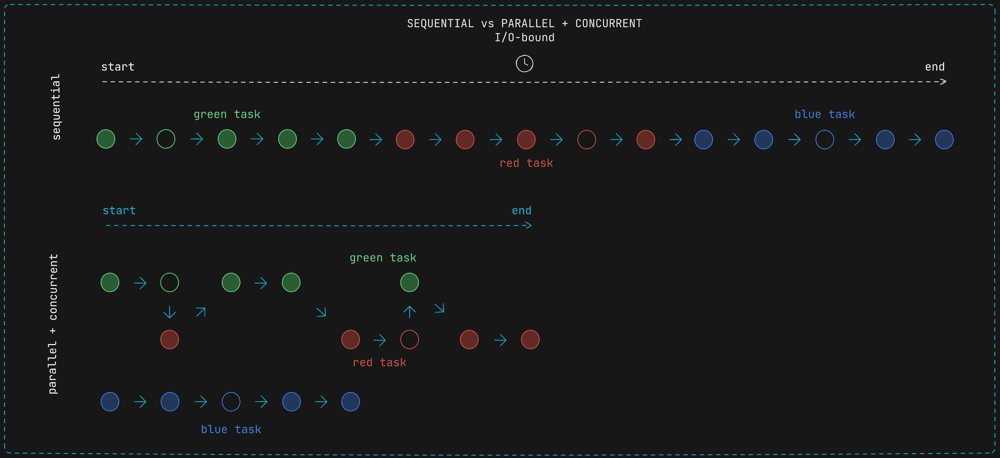
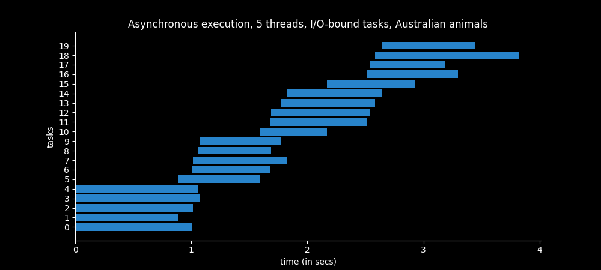
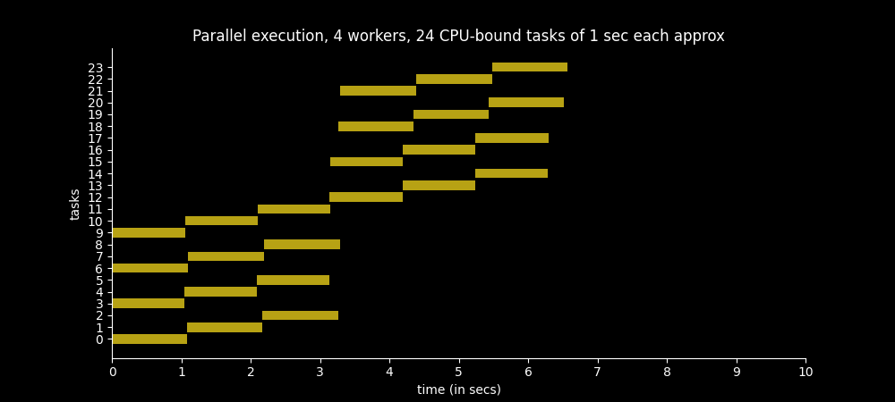
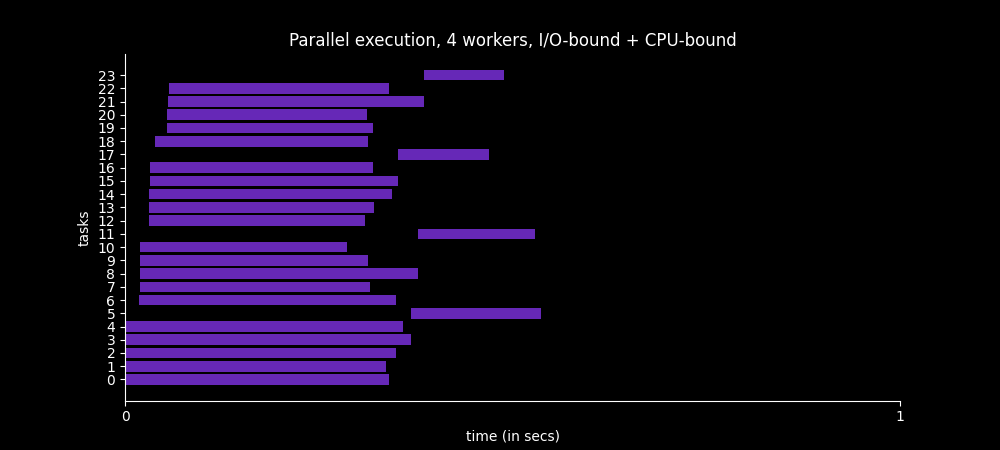

# Concurrency and Parallelism in Python

Code examples of my posts out concurrency and parallelism in Python.

## Install dependencies

You can install the dependecies by installing as a package in "editable" mode:

`pip install -e .`

## Posts

[Introduction to Concurrency and Parallelism](https://www.javideveloper.com/introduction-to-concurrency-and-parallelism)

[Threading in Python](https://www.javideveloper.com/threading-in-python)

[Multiprocessing in Python](https://www.javideveloper.com/multiprocessing-in-python)

[ProcessPoolExecutor in Python](https://www.javideveloper.com/processpoolexecutor-class-in-python)
